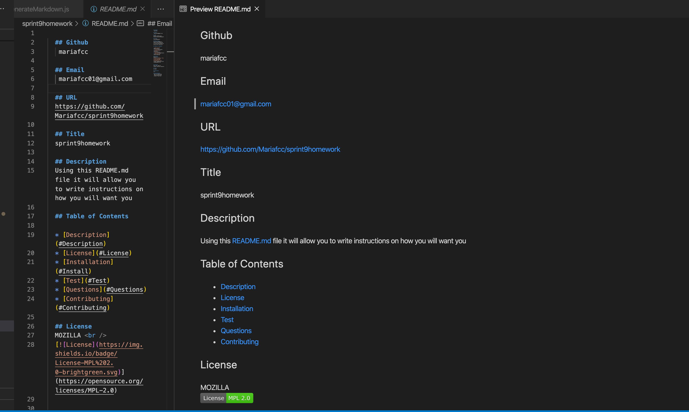
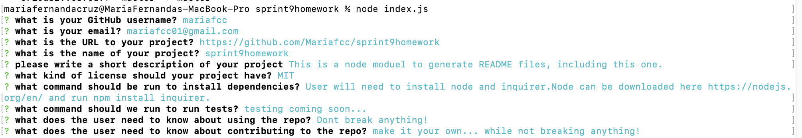

## Github

mariafcc

## Email

mariafcc01@gmail.com

## URL

https://github.com/Mariafcc/sprint9homework

## Title

sprint9homework

## Description

This is a node moduel to generate README files, including this one.

## Table of Contents

- [Description](#Description)
- [License](#License)
- [Installation](#Install)
- [Test](#Test)
- [Questions](#Questions)
- [Contributing](#Contributing)

## License

MIT  

## Install

User will need to install node and inquirer.Node can be downloaded here https://nodejs.org/en/ and run npm install inquirer.

## Test

testing coming soon...

## Questions

Dont break anything!

## Contributing

make it your own... while not breaking anything!
